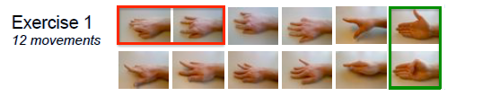
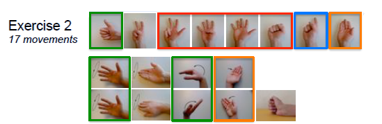
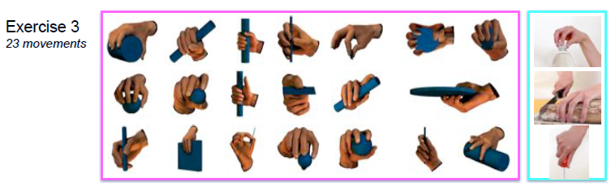
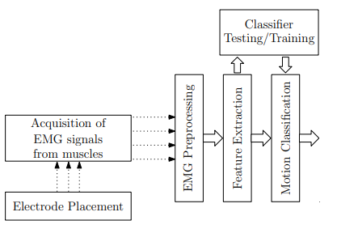
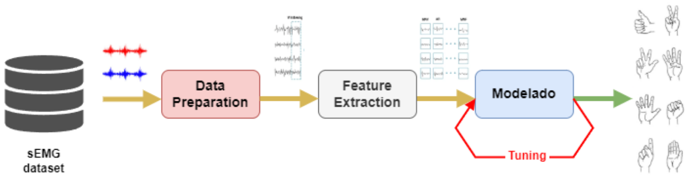

# Entrega 1 de aprendizaje de maquina

## Autores

* Jairo Agudelo M.
* Henry Arcila.

## Descripción del dataset

Las bases de datos de Ninapro (Non-Invasive Adaptive Prosthetics Database) son colecciones de datos que contienen información de señales de electromiografía (EMG) y otros sensores, diseñadas para investigar el control de prótesis mioeléctricas. Aquí presentamos una comparación de las bases de datos más comunes de Ninapro:

| Característica                | DB1   | DB2    | DB4    | DB5      |
|-----------------------------|-------|--------|-------|----------|
| **Año de publicación**        | 2012  | 2013   | 2015   | 2017     |
| **Sujetos**                   | 27   | 40 ()     |10     | 11       |
| **Numero de movimientos**       | 52    | 50     |40     | 67       |
|**Sensores sEMG**              |Ottobock 13E200-50|Delsys Trigno Wireless|Cometa miniWave + Dormo|Thalmic Myo (double & single)|
| **Número de canales EMG**     | 10    | 12  | 16     | 12    |

En nuestro caso se seleccionó la base de datos DB1 ([link](https://ninapro.hevs.ch/instructions/DB1.html)) la cual se resume a continuación:

| **Características**            | **Descripción**                                                                 |
|--------------------------------|---------------------------------------------------------------------------------|
| **Participantes**              | 27 sujetos sanos  (mujeres y hombres)                                           |
| **Electrodos**                 | 10 electrodos de superficie colocados en el antebrazo                           |
| **Frecuencia de Muestreo**     | 100 Hz                                                                          |
| **Movimientos Registrados**    | 52 movimientos de mano y dedos (gestos básicos, isométricos y dinámicos)        |
| **Sensores Adicionales**       | Acelerómetro 3D para capturar datos de movimiento (ejes X, Y, Z)                |
| **Propósito**                  | Investigación para mejorar el control de prótesis de mano basada en señales EMG |
| **Duración de Cada Registro**  | Cada movimiento dura alrededor de 5 segundos                                    |
| **Etiquetas de Movimiento**    | Cada registro está etiquetado con el tipo de movimiento realizado               |

Tal y como se muestra en la tabla anterior, la información obtenida de los sensores es almacenada en una base de datos. Los registros de cada sujeto se almacenan en un archivo de la forma **`sx.zip`** (Donde `x` es el numero del sujeto).

Es importante resaltar que las señales adquiridas de los diferentes sensores y que estan asociadas a cada archivo **`sx.zip`** estan relacionada con tres tipos de ejercicios compuestos de diferentes posturas como se muestra en la siguiente tabla:

|Ejercicio|Movimientos|Descripción|
|----|----|----|
|1|	12|	Individuales de dedos|
|2|	17|	Agarres y posturas de mano|
|3|	23|	Gestos funcionales|

En las siguientes figuras se muestran las diferentes posturas realizadas:

* **Posturas ejercicio 1**:
  
  

* **Posturas ejercicio 2**:
  
  

* **Posturas ejercicio 3**:
  
  

La siguiente figura adaptada del articulo **Effect of Analysis Window and Feature Selection on Classification of Hand Movements Using EMG Signal** [[link]](https://web.lums.edu.pk/~imdad/pdfs/papers/20_08_effect_of_analysis_window.pdf) resume que se pretende realizar en este trabajo:

Es importante anotar, que nuestro trabajo solo se limita a los movimientos del realizados en el ejercicio 1 y solo tentra en cuenta las muestras capturadas por los electrodos de superficie. Esto se abordara con mas detalle en los notebooks.

## Objetivo a desarrollar

Aplicar diferentes modelos de aprendizaje para un subconjunto de datos de la base de datos ninapro BD1 ([link](https://ninapro.hevs.ch/instructions/DB1.html)) y comparar su rendimiento. 

## Resumen del proceso realizado

La siguiente figura muestra el procedimiento realizado para llevar a cabo la clasificación:

## Desarrollo de los experimentos

### Pasos previos

Esta parte se agrega ya que los datos no son estructurados. El objetivo final es llevar estos a una representación que los haga mas adecuados para poderlos meter en el modelo de aprendizaje. El notebook con la preprosamiento de los datos se muestra en el siguiente [[link]](./notebooks_pasos_previos/00_preprocesamiento_dataset_clasificacion.ipynb)

### Preparación de datos

El siguiente [[link]](./notebooks_pasos_previos/01_preparacion_dataset_clasificacion.ipynb) contiene el proceso llevado a cabo para la preparación de los datos.

### Creación de modelos

Los modelos empleados para llevar a cabo la clasificación, se muestran a continuación:
1. Modelo de regresión logistica [[link]](./notebooks_pasos_previos/02_regresion_logistica.ipynb)
2. Modelo K-NN [[link]](./notebooks_pasos_previos/03_KNN_hiperparametros.ipynb)
3. Modelo de arboles de decisión [[link]](./notebooks_pasos_previos/04_arboles_decision_clasificacion.ipynb)
4. Modelo de arboles de decisión usando Random Forest [[link]](./notebooks_pasos_previos/05_arboles_decision_random_forest_clasificacion.ipynb)
5. Modelo Ada-Boost [[link]](./notebooks_pasos_previos/06_ada_boost_clasificacion.ipynb)

## Evaluación de los modelos

Ver Notebook con la evaluación de los modelos [[link]](./notebooks_pasos_previos/07_evaluacion_entre_modelos_clasificacion.ipynb)

## Presentaciones

Las presentaciones se encuentran en el siguiente [enlace](./Presentacion%20final.pdf)

## Referencias

* https://www.techscience.com/cmc/v72n1/46931/html
* Notas de clase
* https://github.com/gedeck/practical-statistics-for-data-scientists
* https://github.com/mbeveridge/Bruce_Practical-Statistics
